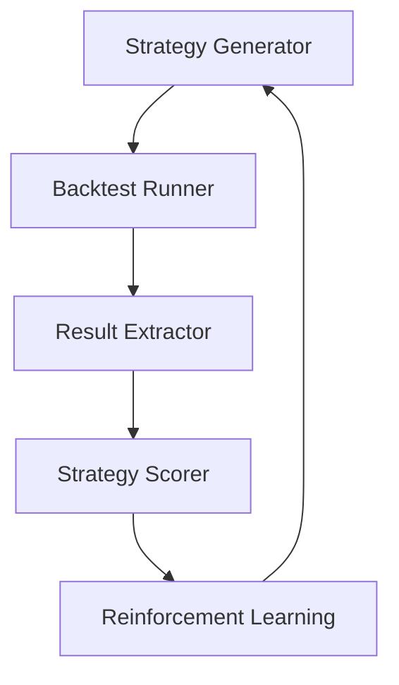

# TradingView AI Strategist

基於 AI 的交易策略生成和優化系統，整合了 TradingView 回測功能。

## 功能特點

- 使用 GPT-4 生成和改寫交易策略
- 自動化 TradingView 回測流程
- 策略效能評分系統
- 使用強化學習優化策略參數
- 完整的數據庫記錄

## 系統架構



## 安裝

1. 克隆倉庫
```bash
git clone https://github.com/yourusername/tradingview_ai_strategist.git
cd tradingview_ai_strategist
```

2. 創建並激活虛擬環境
```bash
python -m venv venv
source venv/bin/activate  # Linux/Mac
venv\Scripts\activate     # Windows
```

3. 安裝依賴
```bash
pip install -r requirements.txt
```

4. 設置環境變量
```bash
cp .env.example .env
# 編輯 .env 文件，填入必要的配置
```

## 使用方法

1. 初始化數據庫
```python
from database.db_handler import init_db
init_db()
```

2. 生成和優化策略
```python
from controller import Controller

controller = Controller()
result = controller.run_optimization_cycle({
    "market": "BTCUSDT",
    "timeframe": "1D",
    "strategy_type": "trend_following"
})
```

## 開發

1. 運行測試
```bash
pytest tests/
```

2. 檢查代碼風格
```bash
flake8 .
```

## 項目結構

## 許可證

MIT 